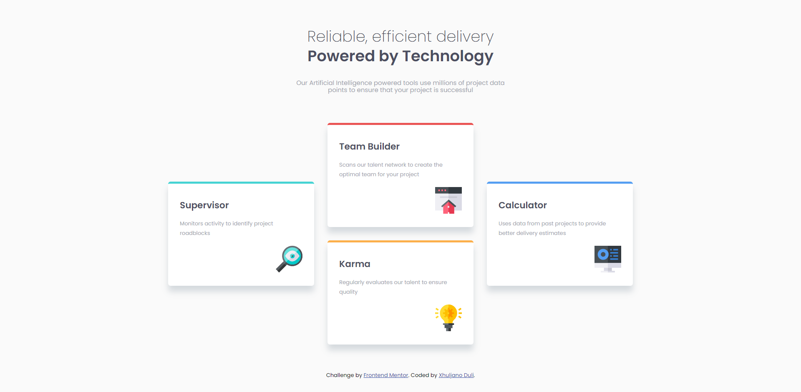

# Frontend Mentor - Four card feature section solution

This is a solution to the [Four card feature section challenge on Frontend Mentor](https://www.frontendmentor.io/challenges/four-card-feature-section-weK1eFYK). Frontend Mentor challenges help you improve your coding skills by building realistic projects.

## Table of contents

- [Overview](#overview)
  - [Screenshot](#screenshot)
  - [Links](#links)
  - [The challenge](#the-challenge)
- [My process](#my-process)
  - [Built with](#built-with)
- [Author](#author)

**Note: Delete this note and update the table of contents based on what sections you keep.**

## Overview

### Links

- Solution URL: [https://github.com/xhuljanoduli/frontend-mentor/tree/main/four-card-feature-section](https://github.com/xhuljanoduli/frontend-mentor/tree/main/four-card-feature-section)
- Live Site URL: [https://xhuljanoduli.github.io/frontend-mentor/four-card-feature-section/index.html](https://xhuljanoduli.github.io/frontend-mentor/four-card-feature-section/index.html)

### Screenshot

### The challenge

Users should be able to:

- View the optimal layout for the site depending on their device's screen size

## My process

### Built with

- Semantic HTML5 markup
- CSS custom properties
- Flexbox
- CSS Grid

## Author

- Website - [Add your name here](https://www.your-site.com)
- Frontend Mentor - [@yourusername](https://www.frontendmentor.io/profile/yourusername)
